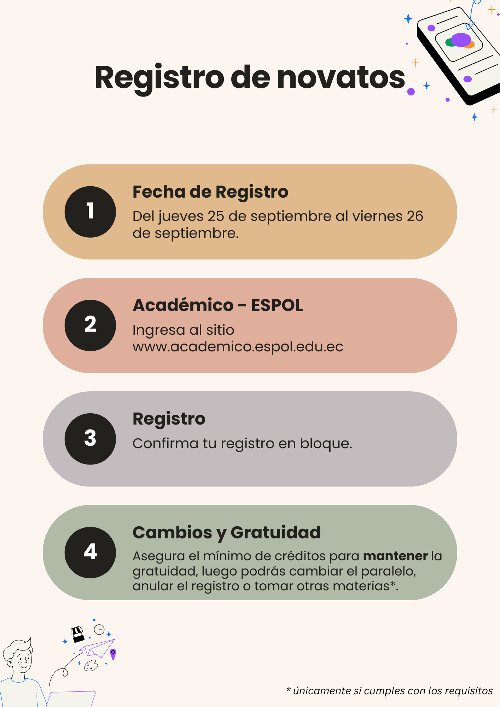

..
  Copyright (c) 2025 Allan Avendaño Sudario
  Licensed under Creative Commons Attribution-ShareAlike 4.0 International License
  SPDX-License-Identifier: CC-BY-SA-4.0

===================
Registro de Novatos
===================

Proceso de Registro
-------------------

Sesión informativa
------------------

Las sesiones informativas se realizaron los días **martes 16 de septiembre de 2025** y **jueves 18 de septiembre de 2025**, a las **5:00 PM**, mediante una videoconferencia en **Zoom**. En estas sesiones se explicó acerca del funcionamiento de la ESPOL y de la FIEC, datos generales de la carrera Ciencia de Datos e Inteligencia Artificial, así como el proceso de registro, requisitos para mantener la gratuidad y se resolvieron todas las dudas que puedan tener los novatos.

En caso de que no hayas podido asistir a la sesión informativa, puedes ver la grabación en el siguiente enlace: `Grabación de la Sesión Informativa <https://drive.google.com/drive/folders/1gI1Dxmrvl9bsGqhIldhIVMq4lUlVchgH?usp=sharing>`_.